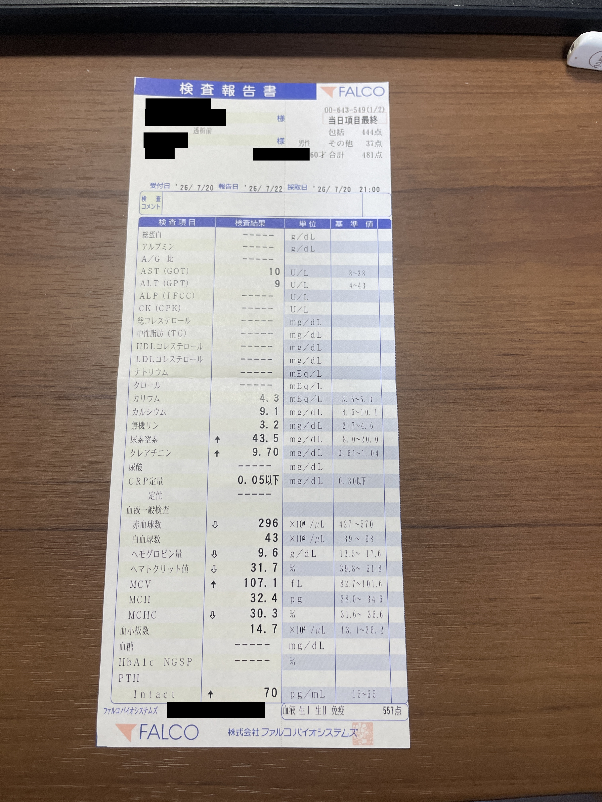
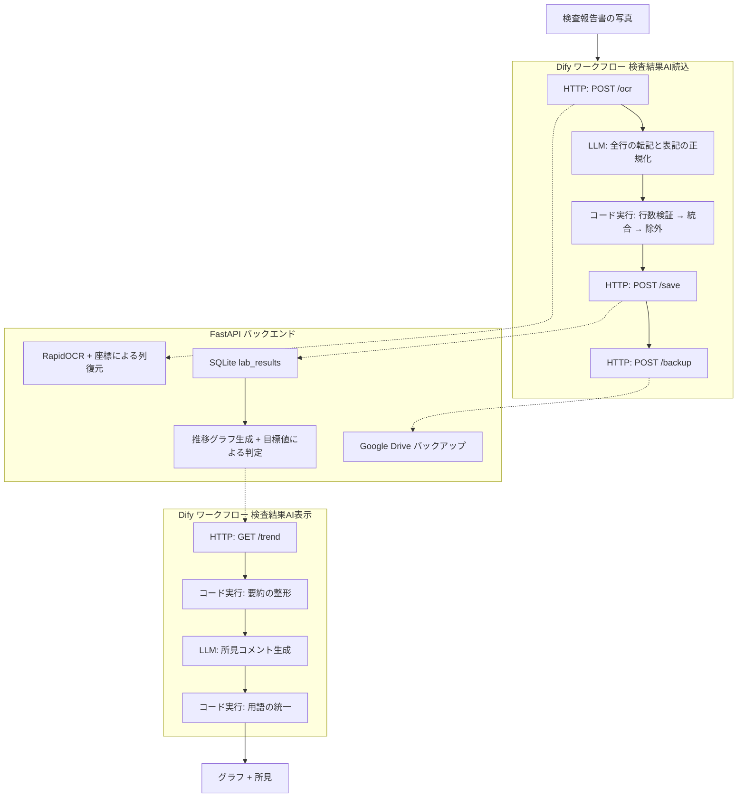

# 検査結果解析AI

検査報告書をスマートフォンで撮影するだけで、検査値をデータベース化し、
推移グラフと所見コメントを自動生成するシステム。

ローカル環境で完結する構成(Dify + Ollama + FastAPI)で、検査データを外部に送信しない。

---

## 課題

定期的に血液検査を受けていると、その都度A4サイズの検査報告書を受け取る。
記載項目は40を超え、数値の推移を自分で追うには手作業で転記するしかない。

紙の帳票をそのまま構造化データにできれば、推移の把握と管理が容易になる。

### 入力例

患者を特定できる箇所(氏名・患者番号・生年月日・検体番号・クリニック名など)は
掲載にあたり黒塗りしている。



---

## 開発の経緯

当初は画像を直接vision対応のLLM(gemma4:12b → qwen3-vl:8b)に渡し、
1回の呼び出しでJSON化まで完了させる構成を想定していた。
小さい数値を基準値列の値と取り違える、桁を捏造するといった誤りが頻発し、
まずOCRでテキスト化してからLLMに渡す構成に切り替えた。

ところが、この構成でも精度は安定しなかった。ある回では処理時間が5分を超え、
出力トークンを上限まで使い切ったにもかかわらずJSONが1文字も返らないという
症状(暴走)が発生した。プロンプトの言い回しを直しても再現するため、
実際にモデルの生成内容を直接取得して調べたところ、出力の大半が
`<think>`タグ内の推論で埋まっていることが分かった。

推論の中身を読むと、モデルは「同じ2列の並びなのに、ある行は検査結果、
別の行は単位を意味する」という構造の曖昧さに延々と自問自答していた。
これはプロンプトの精度ではなく、**OCRがテキスト化した時点で
表の列位置の情報を失っていること**が根本原因だった。

この診断に基づき、OCR側で各セルの座標を保持し、ヘッダー行(検査項目/検査結果/単位/基準値)
のx座標を基準に列を再構成する処理を`main.py`に実装した。これにより行ごとの列数が
常に4列に揃い、LLMが構造を推測する必要が無くなった(詳細は次節「技術的な工夫」を参照)。

なお、列の曖昧さを解消した後も、qwen3-vl:8bやgemma4:12bのような
思考(reasoning)機能を持つモデルは、定型的な転記タスクでも思考を続けて
出力トークンを使い切ることがあり、そもそもこの用途に向かないと判明した。
最終的に、思考機能を持たないqwen2.5:14b-instructへ落ち着いている。

---

## システム構成



### 責務の分担

| 層 | 担当 | 実装 |
|---|---|---|
| 文字認識 | 帳票のテキスト化 | RapidOCR |
| **表構造の復元** | 座標から4列を再構成 | `main.py` |
| 転記・表記の正規化 | 全行のJSON化、簡体字・矢印・読み仮名の除去 | **LLM** (qwen2.5:14b-instruct) |
| 検証 | 転記行数の一致確認 | Difyコード実行ノード |
| 構造化 | 続きの行の統合、未実施の除外、項目名の統一 | Difyコード実行ノード |
| 永続化 | 検査値の保存 | SQLite |
| 評価 | 外部基準による目標値との比較 | `trend_graph.py` |
| 所見生成 | 本人向けの平易なコメント | **LLM** (qwen2.5:14b-instruct) |

---

## 技術的な工夫

### 1. 座標情報による表構造の復元

OCRは帳票を行単位のテキストに変換するが、**空欄の位置情報が失われる**。
その結果、行ごとに列数がバラバラになり、同じ「2列」でも意味が異なる状態が生じる。

```
血液型ABO式    型        ← 2列目は「単位」
HCV抗体CLIA法  陰性      ← 2列目は「検査結果」
```

この曖昧さは、文脈を読まないと解けない。LLMに解かせようとすると延々と推論し、
出力トークンを使い切って結論に到達しない事態が発生した。

**解決策**: ヘッダー行(`検査項目 / 検査結果 / 単位 / 基準値`)のx座標を基準に、
各セルを重なりが最大の列へ割り当て、欠けた列は空のまま4列で出力する。

```
血液型ABO式		型	     ← 3列目 = 単位
HCV抗体CLIA法	陰性		 ← 2列目 = 検査結果
```

これにより後段の処理が決定的になり、LLMの負荷も大幅に下がった。

> インデント(字下げ)による判別も検討したが、撮影時の遠近ゆがみでx座標が
> ページ上部から下部にかけて約120px流れるため、閾値判定は成立しなかった。

### 2. LLMとルールベースの役割分担

LLMに「不要な行を捨てる」判断まで任せたところ、**過剰に適用して正しい行まで削除した**
(17件が9件に減少)。逆に「全行を転記する」ことだけに専念させると安定した。

| 担当 | 処理 | 理由 |
|---|---|---|
| LLM | 全行の転記、簡体字・矢印・読み仮名の除去 | 表記の揺れは規則化しにくい |
| コード | 統合・除外・項目名の統一 | 判断基準が確定しており、確実性が求められる |

### 3. 出力の検証層

LLMは指示に反して行を落とすことがある。実際に、`PTH`行の欠落が後続行のずれを招き、
存在しない検査値(`HbA1c = 70 pg/mL`)が生成された事例があった。

対策として、OCRの表の行数とLLMの出力件数を突き合わせ、
`row_check` として実行結果に表示する。不一致を検知できる状態にした。

### 4. ドメイン固有ルールによる判定基準の上書き

帳票に印字されている基準値は、多くの場合**汎用的な基準**である。対象者や利用シーンに
よっては、この基準をそのまま適用すると実態と異なる判定になることがある。

そこで、帳票の基準値より優先して適用できる「目標値テーブル」を項目ごとに用意した。
該当する項目があれば判定はそちらを優先し、無ければ帳票の基準値をそのまま使う。
目標値は独自の判断で決めるのではなく、根拠のある外部の基準(業界団体のガイドライン等)
から設定することを前提にした設計にしている。

この仕組みにより、汎用基準では継続的に「基準外」と判定され続けていた項目が
実態に即した評価に変わり、逆に汎用基準では見逃されていた項目が
正しく検出されるようになった。

> 目標値はあくまで一般的な目安であり、個別の判断は専門家に委ねる前提とした。
> 本システムが生成する所見も、断定的な判断ではなく参考情報として位置づけている。

### 5. 実測に基づくモデル選定

ローカルLLMを4種類比較した。**思考(reasoning)機能を持つモデルは、この用途では
無効化できず使えない**という結論に至った。

| モデル | 思考機能 | 結果 |
|---|---|---|
| qwen3-vl:8b | あり | 8,192トークンすべてを思考に消費し、JSONを出力せず |
| gemma4:12b | あり | 21,826文字を思考し、同じく出力なし |
| qwen2.5:7b-instruct | なし | 出力するが、条件付きルールの適用が不安定 |
| **qwen2.5:14b-instruct** | なし | **34行を過不足なく転記。採用** |

思考の無効化は4通り試したが、いずれも効果がなかった。

| 指定方法 | 生成された思考 |
|---|---|
| 指定なし | 925文字 |
| `think=false` | 823文字 |
| `think=false` + `think_level=low` | 981文字 |
| `enable_thinking=False` (OpenAI互換API) | 654文字 |

### 6. プロンプト設計

抽象的な禁止(「行を省略してはならない」)では改善せず、
**期待する動作を具体例で示す**ことで解決した。

```
## 転記の例(入力5行 → 出力5件。空の列は空文字のまま写す)
  HBs抗原精密測定	陰性　インセイ		
  IU/mL	0.05未満	IU/mL	0.05未満 陰性
  ...
→
  {"name":"HBs抗原精密測定","result":"陰性","unit":"","ref":""}
  {"name":"IU/mL","result":"0.05未満","unit":"IU/mL","ref":"0.05未満 陰性"}
  ...
```

また、JSONのキーは**英字に統一**した。日本語キーを指定すると、
モデルが簡体字に変換してしまうことがあるため(`項目名` → `项目名`、`検査結果` → `检测结果`)。
これはデータベースの列名を英字にした理由でもある。

---

## 実測値

| ページ | 表の行数 | LLM転記 | 検証 | 保存件数 | 所要時間 |
|---|---|---|---|---|---|
| 1ページ目(生化学・血液一般) | 34行 | 34件 | 一致 | 17件 | 43.7秒 |
| 2ページ目(免疫) | 11行 | 11件 | 一致 | 4件 | 17.3秒 |

数値項目・定性項目(陰性/陽性)・検出限界以下の表記(`0.05未満`)のいずれも、
情報を失わずに保存できることを確認した。

---

## データ設計

非数値の検査結果を扱うため、数値と原文を分離して保持する(一部の列は省略)。

```sql
CREATE TABLE lab_results (
    id            INTEGER PRIMARY KEY AUTOINCREMENT,
    exam_date     TEXT NOT NULL,   -- 検査日
    exam_time     TEXT NOT NULL,   -- 時刻
    name          TEXT NOT NULL,   -- 項目名
    result        REAL,            -- 数値。数値化できなければNULL
    result_text   TEXT,            -- 帳票の原文
    unit          TEXT,
    reference     TEXT,            -- 帳票の基準値
    UNIQUE(exam_date, exam_time, name)
);
```

| 帳票の表記 | `result` | `result_text` |
|---|---|---|
| `9.70` | `9.7` | `9.70` |
| `0.05以下` | `0.05` | `0.05以下` |
| `陰性` | `NULL` | `陰性` |

グラフ描画には `result` を、記録の閲覧には `result_text` を使う。

---

## 使用技術

| 分類 | 技術 |
|---|---|
| ワークフロー | Dify (セルフホスト) |
| LLM | Ollama + qwen2.5:14b-instruct |
| OCR | RapidOCR (PP-OCRv6, ONNX Runtime) |
| バックエンド | FastAPI, Uvicorn |
| データストア | SQLite |
| 可視化 | Matplotlib |
| バックアップ | Google Drive API |

---

## ディレクトリ構成

```
.
├── main.py           # FastAPI本体、/ocr(RapidOCR + 座標による列復元)
├── char_map.py       # 簡体字 → 日本語字体の変換表
├── word_map.py       # OCR誤読の単語レベル置換表
├── save.py           # DB保存ロジック、スキーマ定義と自動マイグレーション
├── save_api.py       # /save
├── trend_graph.py    # 推移グラフ生成、学会目標値との判定
├── trend_api.py      # /trend, /trend_image
├── backup.py         # Google Driveへのバックアップ
├── backup_api.py     # /backup
└── dify/             # Difyワークフロー定義(エクスポートしたYAML)
```

---

## セットアップ

```bash
python -m venv .venv
.venv\Scripts\activate
pip install -r requirements.txt
uvicorn main:app --reload
```

Google Driveバックアップを使う場合は、GCPでOAuthクライアントを作成し
`setup_drive_auth.py` を実行して認証する。

> OAuth同意画面が「テスト中」のままだと、リフレッシュトークンが7日で失効する。
> `drive.file` スコープであれば審査なしで「本番環境」へ公開できる。

---

## 注意事項

- 本システムが生成する所見は**医療アドバイスではない**。診断・治療方針は主治医の判断による
- 対象帳票はファルコバイオシステムズの検査報告書に限定している。
  データモデルは汎用に保ち、帳票様式に依存する知識はプロンプト層に隔離している
